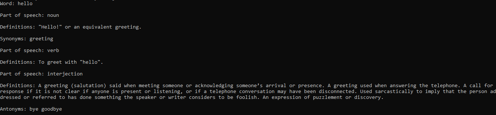

# dictionary-cli

> CLI application to find meaning of English Words

<a href="https://github.com/joaovictorpsantos">
  
</a>

<a href="https://twitter.com/intent/follow?screen_name=_joaovictorps">
  
</a>

<br/>

<a href="https://github.com/joaovictorpsantos/dictionary-cli/actions">
  
</a>

<a href="#">
  
</a>

<a href="https://github.com/joaovictorpsantos/dictionary-cli/stargazers">
  
</a>

<a href="https://github.com/joaovictorpsantos/dictionary-cli/network/members">
  
</a>

<a href="#">
  
</a>

<a href="https://github.com/joaovictorpsantos/social-app/commits/master">
  
</a>

# :rocket: Features

- You can pass a word to the CLI and it will search the [API](https://dictionaryapi.dev/) for the meaning along with more information

# :dart: Tools used

- [NodeJS](https://nodejs.org/en/) to create a CLI
- [FlowJS](https://flow.org/) to static type checker
- [Babel](https://babeljs.io/) to compile JavaScript
- [ESLint](https://eslint.org/) to standardize
- [Prettier](https://prettier.io/) to format code

# :construction_worker: Installation

**You need to install [Node.js](https://pt-br.reactjs.org/) and [NPM](https://www.npmjs.com/) first, then in order to clone the project via HTTPS, run this command:**

```
  git clone https://github.com/joaovictorpsantos/dictionary-cli.git
```

SSH URLs provide access to a Git repository via SSH, a secure protocol. If you have a SSH key registered in your Github account, clone the project using this command:

```
  git clone git@github.com:joaovictorpsantos/dictionary-cli.git
```

**Install dependencies**

```
  npm install
```

# :runner: Getting Started

**On Linux**

The dictionary-cli file should have executable permission:

```
  chmod u+x ./dictionary-cli.sh
```

And run:

```
  ./dictionary-cli.sh "Hello"
```

Output:

<p align="center">
   
</p>

**On Windows**

Run

```
  ./dictionary-cli.js "Hello"
```

Output:

<p align="center">
   
</p>

<br/>

<h4 align="center">
  Let's share knowledge and grow together!!!
</h4>

<br/>

---

<h3 align="center">
Author: <a alt="João Victor Pereira Santos" href="https://github.com/joaovictorpsantos">João Victor Pereira Santos</a>
</h3>

<p align="center">

  <a alt="João Victor Pereira Santos Linkedin" href="https://www.linkedin.com/in/joao-victor-pereira-santos//">
    </a>
  <a alt="João Victor Pereira Santos GitHub" href="https://github.com/joaovictorpsantos">
  </a>
 <a alt="João Victor Pereira Santos Twitter" href="https://twitter.com/_joaovictorps">
  </a>

</p>
